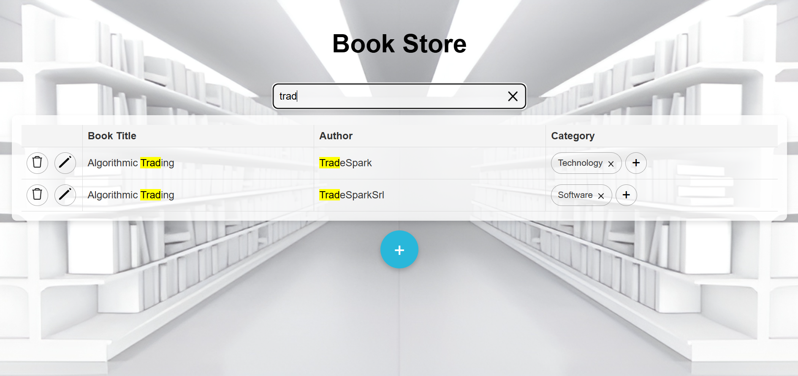
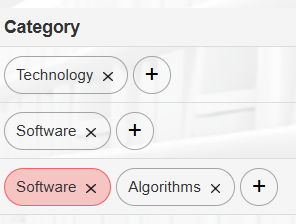
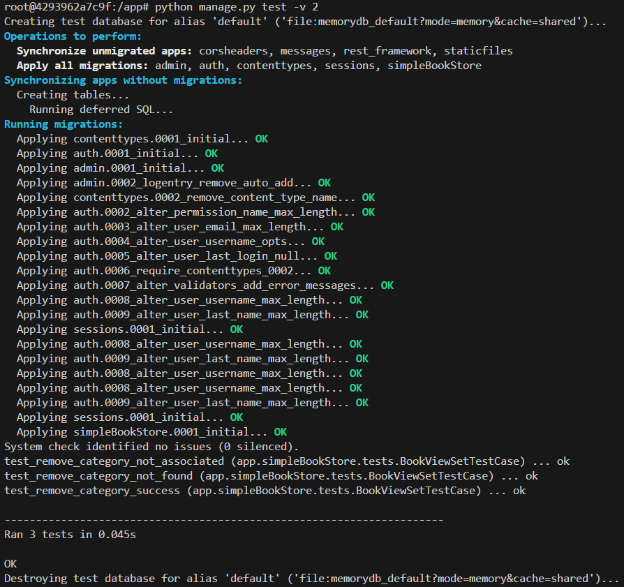
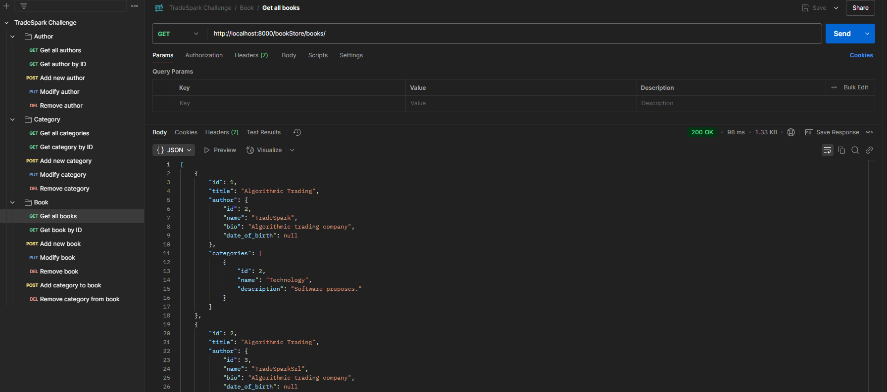

# TradeSpark Challange
## Consignas del Challenge:
- [TradeSpark Challange](#tradespark-challange)
  - [Consignas del Challenge:](#consignas-del-challenge)
  - [Primer punto (Angular, Front-side)](#primer-punto-angular-front-side)
  - [Segundo punto (Django, Back-side)](#segundo-punto-django-back-side)
  - [Tercer punto](#tercer-punto)
  - [Extras](#extras)
    - [Operaciones CRUD](#operaciones-crud)
    - [Pruebas unitarias](#pruebas-unitarias)
    - [Colección Postman](#colección-postman)

---

## Primer punto (Angular, Front-side)
> **Construir un filtro sobre la tabla en la sección "Book store", el cual sea capaz de filtrar por título, autor o categoría.**

Para implementar esta funcionalidad en el frontend, realicé los siguientes pasos:

**1. Creación de componente `SearchBar`:**
- Comencé creando un nuevo componente Angular llamado `SearchBar` para gestionar la entrada del usuario relacionada con el filtro.
- En la lógica del componente (`search-bar.component.ts`), añadí una propiedad `searchText` que almacena el texto ingresado por el usuario. También implementé un `@Output()` llamado `search`, que emite el texto ingresado hacia el componente `BookStore` cada vez que cambia.
- En la plantilla del componente (`search-bar.component.html`), añadí un campo `input` que vincula el texto ingresado con el método `onInputChange()` Adicionalmente creé un botón de cruz que reemplaza al logo de la lupa cuando se escribe en la barra de búsqueda. Cuando es cliqueado borra el contenido del input llamando al método `clearSearch()`.
- Agregué cambios de estilo del componente en el archivo `search-bar.component.css`.
- Incluí el selector del componente `SearchBar` (`<app-search-bar>`) en la plantilla HTML de BookStore, conectándolo al método `onSearch()` mediante el evento `(search)`.

**2. Modificaciones en `book-store.component.ts`:** 
- Agregué una propiedad `searchText` que almacena el texto de búsqueda proporcionado por el componente `SearchBar`.
- Definí una lista `filteredBooks`, que contiene los libros que se muestran en la tabla después de aplicar el filtro.
- En el método `ngOnInit`, inicialicé la lista `filteredBooks` con todos los libros al cargar la página mediante el método `loadBooks()`.
- Escribí un método `onSearch()` que toma el texto de búsqueda y filtra la lista de libros según el título, autor o categoría (el filtro ignora mayúsculas y minúsculas).

**3. Modificaciones en la plantilla `book-store.component.html`**
- Incluí el selector del componente `SearchBar`
- Modifiqué la tabla para que utilice `filteredBooks` en lugar de `books` para que refleje automáticamente los resultados filtrados.
- Se pasan como argumentos el título, autor y categorías al pipe personalizado `HighlightPipe` para que resalte el texto buscado.

**4. Creación de pipe `HighlightPipe`:**
- Implementé un pipe personalizado llamado `HighlightPipe` para resaltar las coincidencias en los resultados de búsqueda. 
- Este pipe toma el texto de entrada y lo transforma, envolviendo las coincidencias con una etiqueta `<mark>`.



---

## Segundo punto (Django, Back-side)
> **Dado el título de un libro y el nombre de una categoría, implementar la eliminación de esa categoría para el libro asociado.**

Para implementar esta funcionalidad en el backend, hice lo siguiente:

**Modificaciones en `views.py`:**
- Creé una nueva función de vista llamada `remove_category()`, que recibe el título del libro (`book_title`) y el nombre de la categoría (`category_name`) en el cuerpo de la solicitud HTTP.
- Este método busca el libro en la base de datos utilizando el modelo `Book`, y luego filtra la categoría asociada.
- Si se encuentra tanto el libro como la categoría, elimina la relación entre ellos (pero no la categoría de la base de datos en general, ya que podría estar asociada a otros libros).
- En base al resultado de la operación, este método devuelve distintos códigos y mensajes de respuesta:
  - Si falta el título del libro o el nombre de la categoría en el cuerpo de la solicitud, devuelve `400 BAD REQUEST` junto con el mensaje `{"detail": "Both book title and category name are required."}`.
  - Si el libro no existe, devuelve `404 NOT FOUND` junto con el mensaje: `{"detail": "Book with title '{book_title}' not found."}`
  - Si la categoría no existe, devuelve `404 NOT FOUND` junto con el mensaje `{"detail": "Category with name '{category_name}' not found."}`.
  - Si la categoría sí existe pero no está asociada al libro, devuelve `400 BAD REQUEST` junto con el mensaje `{"detail": "This category is not associated with the book."}`.
  - Si se elimina exitosamente la categoría, devuelve `204 NO CONTENT` junto con el mensaje `{"detail": "Category removed from book successfully."}`.

>> Aclaración: Para evitar inconsistencias y eliminaciones accidentales, modifiqué los campos `title` y `name` de los modelos `Book` y `Category`, respectivamente, para que fueran únicos con la propiedad `unique=True`. 

---

## Tercer punto
> **Implementar un botón en la sección book store que permite eliminar una categoría perteneciente a un libro. Este botón, al ser clickeado, deberá interactuar con el backend, el cual ejecutará la lógica implementada en el segundo punto para hacer efectiva la eliminación.**

Para realizar este punto, hice lo siguiente:

**Implementación de componente `RemovableTag`:**
- Creé un nuevo componente llamado `RemovableTag` encargado de mostrar una etiqueta y permitir eliminarla al hacerle click. 
- Este componente se utiliza para mostrar únicamente categorías, pero lo diseñé pensando que podría reutilizarse para mostrar otro tipo de información (por ejemplo, filtros de búsqueda, títulos de libros, etc.).
- Mediante el `@Output` llamado `remove`, este componente emite un evento cada vez que el usuario hace click para eliminar el tag.



**Modificaciones en `book-store.component.ts`:**
- Reemplacé el string de categorías separadas por comas, por etiquetas `RemovableTag`. 
- Implementé el método `removeCategory()` para manejar el evento emitido por el componente `RemovableTag`. Este método se llama cuando el usuario hace clic en la etiqueta para eliminarla, tomando el nombre de la categoría y el título del libro.
- Luego, `removeCategory()` se comunica con el servicio `bookStoreService` a través del método `removeCategoryFromBook()`, el cual envía una solicitud HTTP `DELETE` al backend utilizando el método `request()` de la clase `HttpClient`. La solicitud se envía con el siguiente body:
```json
{
    "book_title": bookTitle,
    "category_name": categoryName
}
```
- Al recibir una respuesta, `book-store.component.ts` actualiza la lista de libros o muestra un mensaje de error según el resultado de la eliminación.

---

## Extras
### Operaciones CRUD
Para realizar pruebas, me pareció conveniente implementar otras operaciones CRUD de libros en el frontend para poder ver los cambios en los datos de manera más rápida.

Los métodos que implementé fueron:
- `addBook()`: Solicita al usuario el título y autor de un nuevo libro, y luego lo agrega al backend utilizando el servicio `BookStoreService`.
- `updateBook(bookId: number)`: Permite al usuario actualizar el título y autor de un libro existente, enviando los nuevos datos al backend.
- `deleteBook(bookId: number)`: Solicita confirmación al usuario antes de eliminar un libro del backend, y actualiza la vista.
- `addCategory(bookId: number)`: Solicita al usuario el nombre de una nueva categoría y la asocia al libro correspondiente comunicándose con el backend.
- `removeCategory(bookTitle: string, categoryName: string)`: Llama al backend para eliminar una categoría asociada a un libro específico, y luego recarga la lista de libros actualizada.

>> Aclaración: Los mensajes e inputs son gestionados con funciones `alert()` y `prompt()`, respectivamente. Si bien es esperable que se manejen con formularios HTML explícitos (como en una ventana flotante, por ejemplo), eso hubiera agregado  complejidad innecesaria a la entrega.

### Pruebas unitarias
- Realicé pruebas unitarias en Django (en el archivo `tests.py`) para corroborar el correcto funcionamiento del punto 2 del challenge.
- Los casos de prueba fueron:
  - La categoría a eliminar no está asociada al libro.
  - La categoría no se encuentra en la base de datos.
  - La categoría se elimina correctamente.

**Ejecución de pruebas mediante el comando `python manage.py test -v 2`:**



### Colección Postman
Adjunto en la carpeta `docs/` la colección de Postman con todos los endpoints de la aplicación para realizar pruebas.


